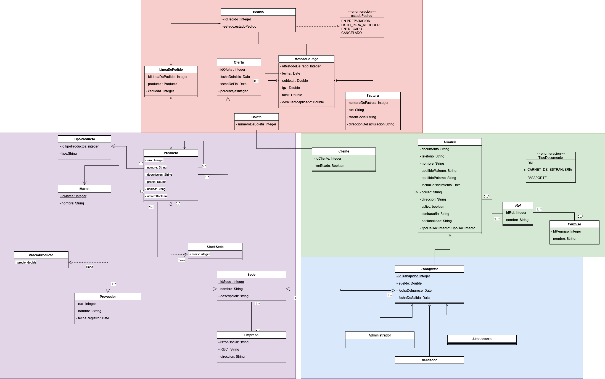
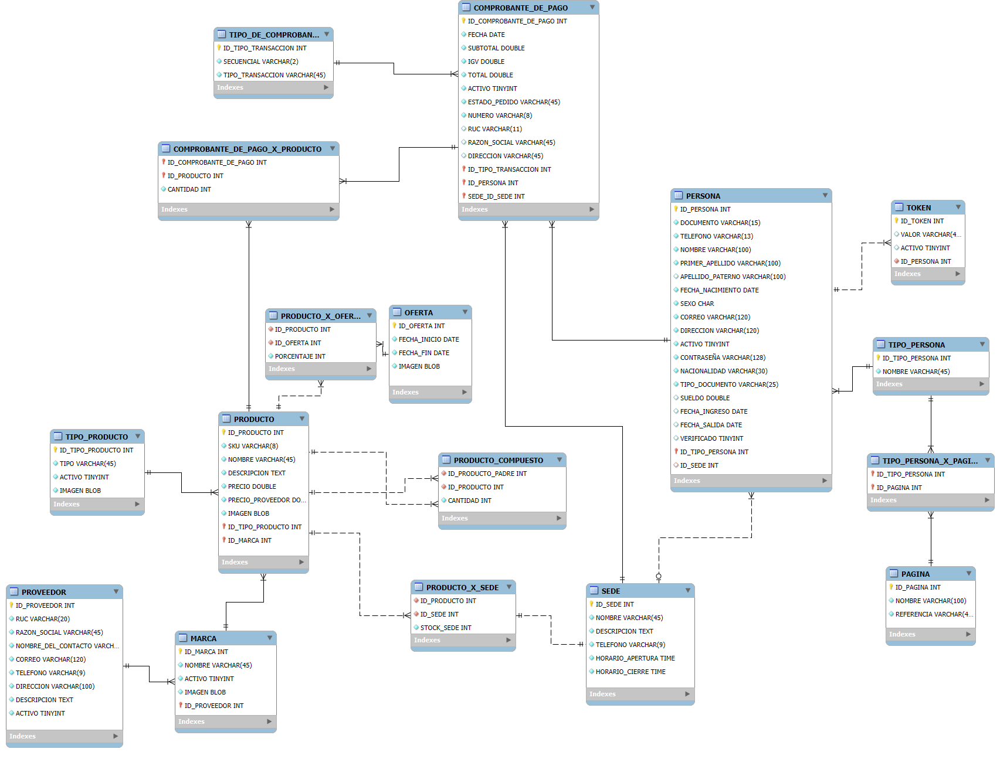

# Cyberia Backend

El siguiente repositorio se va a usar únicamente para la creación de la programación en JAVA y Mysql

```
/CyberiaStoreDBManager # El padre que y nos proporciona el patron singleton
/CyberiaStoreDBManagerTest # Proyecto realiza para las test generales de todos las clases y tablas
/Img # Imagnes para el README
/InventarioDAO # Carpeta con todo lo requerido para la conexion con Base de datos
    |-> /DA
    |-> /BO
    |-> /DAOIMPL
/InventarioModel # Clase de nuestro UML
...
```

## Imagen del UML



## Imagen de la Base de Datos



## Forma de organizar los script en la BD

Forma como vamos a trabajar los script de la base de datos.

```
/BaseDeDatos
    /configuracion_estructura   # Scripts de creación de la estructura de la base de datos.
    /datos_esenciales           # Datos esenciales que necesita la aplicación para funcionar: configuración básica, roles, datos maestros.
    /migraciones_de_datos       # Scripts de migración para cambios incrementales en la estructura o en los datos de la base de datos.
    /datos_de_prueba            # Datos de prueba que se utilizan para desarrollo, pruebas unitarias o ambientes de staging.
    /procedimientos_almacenados # Procedimientos almacenados, funciones y triggers de la base de datos.
    /vistas                     # Scripts de creación y actualización de vistas.
    /scripts_de_respaldo        # Scripts o instrucciones para generar y restaurar backups de la base de datos.
```

## Como conectar el proyecto con la base de datos local

En los siguientes pasos les voy a enseñar como conectar el proyecto con MYSQL y una base de datos Local(propia para su computadora)

